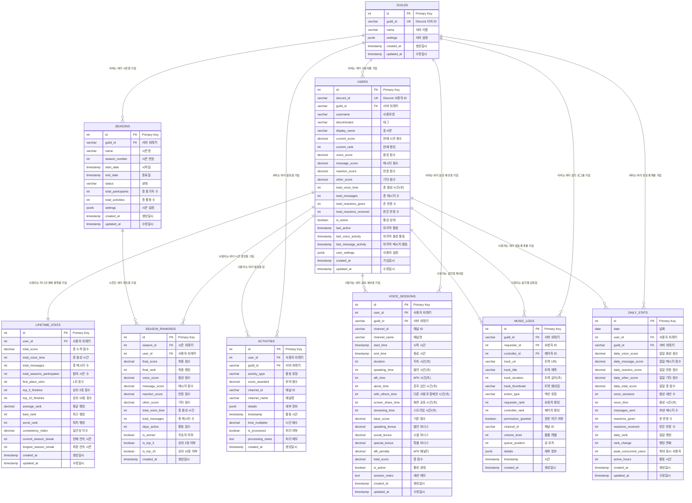

# GodHand Discord Bot - Database ERD

## 개요

GodHand Discord 봇의 PostgreSQL 데이터베이스 구조도입니다. 이 시스템은 계층적 랭킹 시스템과 음악 권한 관리를 위해 설계되었습니다.

**생성일**: 2025-08-13  
**버전**: 1.0  
**데이터베이스**: PostgreSQL  

## ERD 다이어그램



## 테이블 구조 상세 설명

### 🏛️ 핵심 테이블 (Core Tables)

#### GUILDS - Discord 서버 정보
Discord 서버(길드)의 기본 정보를 저장합니다.

**주요 필드**:
- `guild_id`: Discord API에서 제공하는 고유 서버 ID
- `name`: 서버 이름
- `settings`: 서버별 봇 설정 (JSON 형태)

#### USERS - 현재 시즌 사용자 데이터
각 사용자의 현재 시즌 활동 데이터와 실시간 랭킹 정보를 저장합니다.

**주요 필드**:
- `discord_id`: Discord API에서 제공하는 고유 사용자 ID
- `current_score`: 현재 시즌의 총 점수
- `current_rank`: 음악 권한 시스템에 사용되는 실시간 랭킹
- 활동별 점수 분류: `voice_score`, `message_score`, `reaction_score`, `other_score`
- 활동 통계: `total_voice_time`, `total_messages`, 반응 수 등

#### LIFETIME_STATS - 생애 통계
모든 시즌에 걸친 사용자의 누적 통계를 저장합니다.

**주요 필드**:
- `total_score`: 모든 시즌의 누적 점수
- 성과 통계: `first_place_wins`, `top_3_finishes`, `top_10_finishes`
- 성능 지표: `average_rank`, `best_rank`, `consistency_index`
- 참여 기록: `total_seasons_participated`, 연속 시즌 기록

### 📅 시즌 관리 (Season Management)

#### SEASONS - 경쟁 시즌
2주 주기의 경쟁 시즌 정보를 관리합니다.

**주요 필드**:
- `season_number`: 시즌 순서 번호
- `start_date`, `end_date`: 시즌 기간
- `status`: 시즌 상태 (`pending`, `active`, `completed`, `cancelled`)
- `total_participants`: 해당 시즌 참가자 수

#### SEASON_RANKINGS - 시즌 최종 랭킹
완료된 시즌의 최종 랭킹과 상세 결과를 저장합니다.

**주요 필드**:
- `final_score`, `final_rank`: 최종 점수와 랭킹
- 활동별 점수 분석
- 성과 플래그: `is_winner`, `is_top_3`, `is_top_10`

### 📊 활동 추적 (Activity Tracking)

#### ACTIVITIES - 활동 로그
모든 사용자 활동의 상세 로그를 기록합니다.

**활동 유형**:
- 음성 관련: `voice_join`, `voice_leave`, `voice_speaking`, `voice_mute`, `voice_deafen`
- 메시지 관련: `message_create`, `message_delete`, `message_edit`
- 반응 관련: `reaction_add`, `reaction_remove`
- 특별 활동: `screen_share_start/stop`, `stream_start/stop`, `afk_detected/returned`
- 음악 관련: `music_play`, `music_stop`, `music_skip`, `music_queue`

**주요 필드**:
- `score_awarded`: 해당 활동으로 부여된 점수
- `time_multiplier`: 시간대별 점수 배수 (저녁 보너스, 새벽 패널티 등)
- `details`: 활동의 세부 컨텍스트 정보 (JSON)

#### VOICE_SESSIONS - 음성 세션
음성 채널에서의 활동을 세션 단위로 추적합니다.

**주요 기능**:
- AFK 감지 및 패널티 적용
- 발언 시간 vs 단순 접속 시간 구분
- 혼자 있는 시간 vs 다른 사람과 함께하는 시간 구분
- 화면 공유, 스트리밍 등 특별 활동 추적

**점수 체계**:
- `base_score`: 기본 접속 점수
- `speaking_bonus`: 실제 발언에 대한 보너스
- `social_bonus`: 다른 사람과 함께 있을 때의 보너스
- `special_bonus`: 화면 공유, 스트리밍 보너스
- `afk_penalty`: AFK 상태에 대한 패널티

#### DAILY_STATS - 일일 통계
성능 최적화를 위한 일일 집계 데이터입니다.

**용도**:
- 대시보드 및 리포트 생성 최적화
- 랭킹 변화 추적
- 일일/주간/월간 트렌드 분석

### 🎵 음악 시스템 (Music System)

#### MUSIC_LOGS - 음악 로그
계층적 권한 시스템이 적용된 음악 재생 기록입니다.

**권한 시스템**:
- `requester_rank`: 음악을 요청한 사용자의 랭킹
- `controller_rank`: 음악을 제어(정지/스킵)한 사용자의 랭킹
- `permission_granted`: 권한 검증 결과

**액션 유형**:
- `queue_add`: 대기열에 추가
- `play_start/pause/resume/stop`: 재생 제어
- `play_skip`: 스킵 (권한 검증 필요)
- `volume_change`: 볼륨 조절
- `queue_clear`: 대기열 초기화

## 데이터베이스 특징

### 🎯 핵심 설계 원칙

1. **계층적 랭킹 기반 권한 시스템**
   - 현재 랭킹(`users.current_rank`)을 기반으로 한 음악 제어 권한
   - 상위 랭킹 사용자가 하위 랭킹 사용자의 음악을 제어할 수 있음

2. **시즌 기반 경쟁 시스템**
   - 2주 주기로 랭킹이 리셋되는 단기 경쟁
   - 장기적인 참여 동기 부여를 위한 생애 통계 유지

3. **다면적 점수 체계**
   - 음성, 메시지, 반응, 기타 활동별 점수 세분화
   - 시간대별 배수 적용 (시간대별 활동 패턴 반영)

4. **상세한 활동 추적**
   - AFK 시간, 발언 시간, 소셜 상호작용 등 세분화된 추적
   - 음성 세션의 질적 평가 (혼자 vs 함께, 발언 vs 단순 접속)

### ⚡ 성능 최적화

1. **일일 통계 테이블**
   - 실시간 집계 대신 배치 처리를 통한 성능 향상
   - 대시보드 및 리포트 생성 최적화

2. **인덱스 전략**
   - 자주 조회되는 필드들에 대한 복합 인덱스
   - 시간 기반 쿼리 최적화

3. **데이터 파티셔닝 준비**
   - 시간 기반 데이터의 효율적 관리를 위한 구조

### 🔧 확장성 고려사항

1. **JSONB 활용**
   - 설정 및 메타데이터의 유연한 저장
   - 스키마 변경 없이 새로운 기능 추가 가능

2. **트리거 및 함수**
   - `updated_at` 자동 갱신
   - 데이터 일관성 보장

3. **외래키 제약조건**
   - 데이터 무결성 보장
   - CASCADE 옵션을 통한 안전한 데이터 삭제

## 사용 사례

### 실시간 랭킹 조회
```sql
SELECT discord_id, username, current_score, current_rank 
FROM users 
WHERE guild_id = ? AND is_active = true 
ORDER BY current_rank ASC;
```

### 음악 권한 검증
```sql
SELECT u1.current_rank as requester_rank, u2.current_rank as controller_rank
FROM users u1, users u2 
WHERE u1.discord_id = ? AND u2.discord_id = ?;
```

### 시즌 통계 집계
```sql
SELECT 
    u.username,
    sr.final_rank,
    sr.final_score,
    sr.voice_score + sr.message_score + sr.reaction_score + sr.other_score as breakdown
FROM season_rankings sr
JOIN users u ON sr.user_id = u.id
WHERE sr.season_id = ?
ORDER BY sr.final_rank;
```

---

**문서 마지막 업데이트**: 2025-01-28  
**스키마 파일**: `database/schema.sql`  
**인덱스 파일**: `database/indexes.sql` 